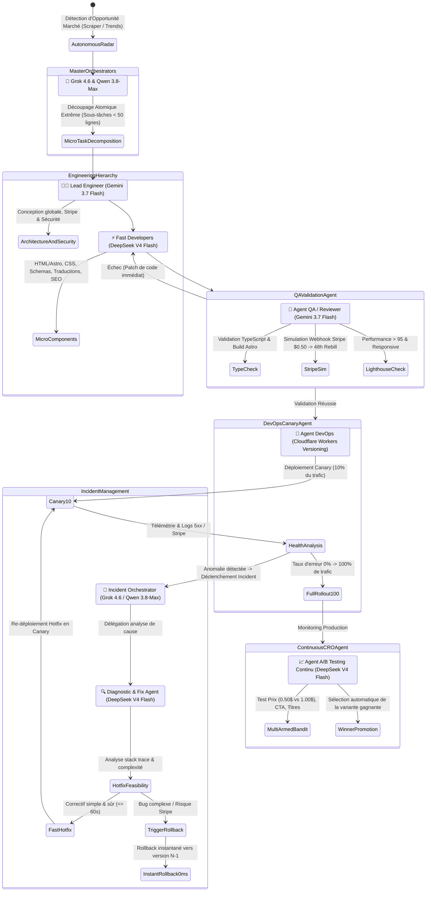

# 📋 Product Requirement Document (PRD) — OmniVenture AI Factory

## 1. Informations Générales
- **Nom du Produit** : OmniVenture AI (Business & Website Factory)
- **Objectif** : Générer, déployer, maintenir et monétiser de façon semi ou totalement autonome des Micro-SaaS, des boutiques Dropshipping, des sites d'Affiliation SEO, des Ebooks Amazon KDP et des campagnes Vidéos Virales (TikTok/Shorts/Reels).
- **Public Cible** : Entrepreneurs du web, créateurs de contenu, affiliate marketers, solopreneurs multi-business.
- **KPIs de Succès** :
  - Vitesse de mise en production d'un site/SaaS complet (< 3 minutes).
  - Taux de conversion moyen des micro-trials ($0.50 $\rightarrow$ rebill).
  - Coût d'inférence LLM & Média < 2% du Chiffre d'Affaires généré.
  - Taux de disponibilité (uptime) et auto-résolution des erreurs > 99%.

---

## 2. Description Détaillée des Modules Métier

### 2.1. Module 1 : Micro-SaaS Engine
#### 2.1.1. Modèles de Monétisation
1. **Modèle Trial $0.50 $\rightarrow$ Rebill 24h / 48h** :
   - L'utilisateur paye 0.50$ (ou 1.00$) pour un accès complet immédiat pendant 24h ou 48h.
   - Lors du paiement, une autorisation de paiement Stripe Customer + SetupIntent est créée.
   - À l'expiration des 24h/48h, Stripe déclenche la souscription récurrente ($29.00/mois ou $49.00/mois).
   - Gestion des relances automatiques par email en cas d'échec de carte.
2. **Modèle Freemium & Paywall par Fonctionnalité** :
   - Tier gratuit avec limite stricte de crédits/générations par jour ou par IP.
   - Modal d'upgrade contextuel dès que l'utilisateur atteint le seuil de monétisation.
   - Tarification mensuelle / annuelle avec réduction de 20%.

#### 2.1.2. Capacités du Générateur SaaS
- **Templates d'Applications Pré-configurés** :
  - Outils IA B2B (Générateurs de contrats légaux, simulateurs financiers, extracteurs de données, convertisseurs de fichiers, assistants emails).
  - Outils Créatifs B2C (Générateur d'avatars, créateur de bio, retouche photo, générateurs de plans de sport/nutrition).
- **Architecture 100% Cloudflare Native avec Astro (`@astrojs/cloudflare`)** :
  - **Framework & SSR Edge** : **Astro** en mode SSR (Server-Side Rendering) avec l'adaptateur officiel `@astrojs/cloudflare`.
  - **Avantages Clés d'Astro pour l'Empire** :
    - *Islands Architecture (Zéro JS par défaut)* : Score Google Lighthouse 100/100, temps de chargement instantané (< 100ms) et SEO ultra-dominant pour les sites d'affiliation et landing pages.
    - *Flexibilité UI Multi-Frameworks* : Intégration transparente de composants dynamiques (React, Svelte ou Vanilla JS) uniquement là où l'interactivité est requise (app SaaS, formulaires de checkout, compteurs d'urgence).
    - *Content Collections & Programmatic SEO* : Capacité native à générer des centaines de pages d'affiliation et fiches produits sans ralentissement.
  - **Backend & API Routes** : Endpoints Astro natifs (`src/pages/api/*.ts`) s'exécutant directement sur Cloudflare Workers.
  - **Base de Données & Persistance** : Cloudflare D1 (SQL relationnel distribué sans serveur).
  - **Cache & Gestion des Sessions** : Cloudflare KV (accès sub-milliseconde pour tokens et quotas d'usage).
  - **Stockage de Médias & Fichiers** : Cloudflare R2 (compatible S3, zéro frais de bande passante).
  - **Moteur IA Intégré** : Cloudflare Workers AI pour inférence edge locale + proxy OpenRouter.
  - **Protection Anti-Abus & Bot Mitigation** : Cloudflare Turnstile natif (CAPTCHA invisible) + Cloudflare WAF.
  - **Paiement & Gestion des Souscriptions** : Endpoints `/api/checkout-trial` et `/api/stripe-webhook` ($0.50 trial $\rightarrow$ 48h rebill).
  - **Déploiement Automatique & Noms de Domaines** : Provisioning instantané de sous-domaines (`*.factory.dev`) ou Custom Domains via l'API Cloudflare for SaaS.

---

### 2.2. Module 2 : Dropshipping & E-Commerce Machine
- **Scraper & Détection de Produits Gagnants (Winning Products)** :
  - Connecteurs API / Scrapers sur AliExpress, Alibaba, TikTok Shop Trending Products.
  - Analyse des métriques : Nombre de commandes, avis positifs, marge bénéficiaire estimée (> 65%), facilité d'expédition.
- **Générateur de Boutiques Mono-Produit & Multi-Produits** :
  - Copywriting axé conversion : Bénéfices majeurs, témoignages clients vérifiés synthétisés, FAQ réassurance.
  - Modules de rareté : Compte à rebours, stock limité dynamique, badges de confiance (Visa, Mastercard, Garantie 30 jours).
  - Tunnels d'Upsell / Cross-sell (ex: "Ajoutez la garantie casse pour 4.90$").
- **Fulfillment & Dispatch** :
  - Webhooks pour notifier le fournisseur ou envoyer une commande automatisée via API dropshipping.

---

### 2.3. Module 3 : Affiliation & Portails SEO de Niche
- **Moteur Programmatic SEO** :
  - Analyse de mots-clés transactionnels à faible concurrence via SerpAPI / DataForSEO.
  - Génération de 50 à 500 pages de comparatifs produits optimisées pour le référencement.
  - Balisage Schema.org (JSON-LD) automatique : `Product`, `Review`, `AggregateRating`, `FAQPage`.
- **Système de Cloaking & Gestion des Liens Affiliés** :
  - Redirection dynamique `/recommande/[slug]` avec attribution des tags affiliés (Amazon Associates, ClickBank, impact.com, CJ).
  - Rotation automatique de liens si un produit est en rupture de stock.

---

### 2.4. Module 4 : Usine à Ebooks & Produits Digitaux (Amazon KDP)
- **Génération Structurée de Livres** :
  - Détection de niches KDP rentables (guides pratiques, recettes santé, développement personnel, finances, manuels techniques).
  - Workflow d'écriture séquentiel :
    1. Table des matières et synopsis global.
    2. Rédaction approfondie chapitre par chapitre avec mémoire contextuelle pour éviter les répétitions.
    3. Relecture orthographique et amélioration stylistique.
- **Mise en page & Exportation** :
  - Export `.epub` pour Kindle Direct Publishing.
  - Export `.pdf` avec marges intérieures/extérieures et typographie de qualité pour impression brochée (Print on Demand).
  - Générateur de descriptions Amazon avec formatage HTML compatible KDP.
- **Couvertures & Illustrations** :
  - Prompts pour générateurs d'images (DALL-E 3, Midjourney, Imagen) avec respect des dimensions standard Amazon KDP.

---

### 2.5. Module 5 : Content & Viral Video Engine (TikTok, Shorts, Reels, YouTube)
- **Génération de Scripts Viraux** :
  - Structure en 3 temps : Hook percutant (0-3s), Valeur / Storytelling (3-25s), Call to Action vers le SaaS ou produit (25-30s).
- **Moteurs Vidéo Supportés** :
  - **MiniMax Video (Hailuo)** : Vidéos ultra-réalistes et mouvements fluides à coût réduit.
  - **Seedance** : Moteur vidéo low-cost pour scènes d'ambiance et démonstrations.
  - **Kling AI / Luma** : Pour les plans cinématiques haute fidélité.
- **Pipeline Audio & Montage Automatisé** :
  - Text-to-Speech : Edge-TTS (gratuit/local) ou ElevenLabs pour voix humaine engageante.
  - Génération et incrustation de sous-titres animés synchronisés au mot près (format 9:16).
  - Assemblage vidéo + voix + musique de fond via script FFmpeg sans latence.

---

## 3. Architecture Multi-Agents & Hiérarchie des Modèles LLM

Le système implémente une **hiérarchie de compétences ultra-optimisée en termes de coûts et d'intelligence**, gérée par le **Cloudflare Agents SDK** et les **Durable Objects** :

### 3.1. Matrice Hiérarchique des Modèles LLM

| Niveau / Rôle | Modèle LLM Précis | Rôle Spécifique | % du Volume de Requêtes | Coût Relatif |
|---|---|---|---|---|
| **Master Orchestrator & Stratège** | **Grok 4.6** & **Qwen 3.8-Max** | Vision stratégique, détection de niche, décomposition en micro-tâches atomiques | ~2% | Modéré (Haute Valeur) |
| **Incident Orchestrator** | **Grok 4.6** & **Qwen 3.8-Max** | Gestion de crise, arbitrage Hotfix vs Rollback immédiat | < 0.5% | Modéré |
| **Lead Engineer & Architecte** | **Gemini 3.7 Flash** | Architecture du code Astro/Workers, intégration Stripe critique, sécurité, prompt engineering complexe | ~18% | Faible / Haute Précision |
| **Confirmed Sub-Worker Coder** | **DeepSeek V4 Flash** | Génération de composants Astro unitaires, routes API simples, styles CSS, métadonnées SEO, copy d'articles | ~74.5% | Ultra-Faible (Économie Maximale) |
| **Diagnostic & Hotfix Worker** | **DeepSeek V4 Flash** | Analyse stack traces, identification root-cause, proposition de patchs d'urgence | ~1% | Ultra-Faible |
| **Agent QA & Recette Automatisée** | **Gemini 3.7 Flash** | Compilation, audit de code, simulation de tunnels de paiement et validation de conformité | ~3% | Faible |
| **Agent DevOps & Canary** | **Cloudflare Agents SDK** | Routage dynamique du trafic (Cloudflare Gradual Rollouts), vérification d'uptime et rollback | ~1% | Gratuit (Edge Workers) |
| **Agent A/B Testing & CRO Continu** | **DeepSeek V4 Flash** | Génération de variantes (titres, CTA, prix d'essai $0.50 vs $1.00, durée 24h vs 48h) et arbitrage statistique | ~1% | Ultra-Faible |

---

### 3.2. Moteur de Découpage Atomique (Micro-Task Decomposition)
Pour réduire la facture LLM de plus de **85%** par rapport aux pipelines monolithiques classiques :
1. **L'Orchestrateur (Grok 4.6 / Qwen 3.8-Max)** ne génère jamais de code directement. Il produit un graphe de dépendances (DAG) composé de micro-tâches indépendantes.
2. **Gemini 3.7 Flash (Lead)** définit les interfaces TypeScript et les contrats d'API.
3. **DeepSeek V4 Flash (Workers)** exécute chaque micro-tâche en parallèle de manière ultra-rapide (ex: un composant UI unique, un endpoint de traitement, un balisage Schema.org).

---

### 3.3. Gestion des Incidents : Canary, Diagnostic Économique, Hotfix & Rollback
1. **Surveillance Canary (Cloudflare Workers Versioning)** :
   - Chaque nouvelle version du SaaS / boutique est déployée sous un tag de version Cloudflare.
   - L'Agent DevOps attribue **10% du trafic** à la nouvelle version pendant une fenêtre d'observation.
   - Si les métriques sont parfaites (0% HTTP 5xx, Stripe OK) $\rightarrow$ promotion automatique à **100% de trafic**.
2. **Processus d'Incident Autonome (Incident Orchestration)** :
   - Dès qu'une anomalie est captée (taux d'erreur 5xx > 0.5%, timeout API, webhook Stripe rejeté) :
   - **L'Incident Orchestrator (Grok 4.6 / Qwen 3.8-Max)** prend le contrôle de l'incident et gèle immédiatement l'extension du canary.
   - Il missionne l'**Agent Diagnostic (DeepSeek V4 Flash - Ultra Low Cost)** pour analyser les logs d'erreurs, la stack trace et le diff du commit.
3. **Arbitrage Hotfix vs Rollback Immédiat** :
   - **Branche A — Hotfix Rapide (Erreur isolée / Facilement réparable)** :
     - Si le problème est un bug simple (ex: faute de frappe dans une variable d'env, typage manquant, sélecteur CSS), l'agent DeepSeek V4 Flash rédige un micro-patch.
     - L'Agent QA valide le patch en < 15 secondes.
     - L'Agent DevOps applique le **Hotfix en Canary** et relance la surveillance.
   - **Branche B — Rollback Instantané (Bug critique / Complexe)** :
     - Si le bug touche la structure de la base D1, l'authentification de sécurité ou une rupture du flux Stripe :
     - L'Incident Orchestrator déclenche le **Rollback Immédiat (0ms)** vers la version stable précédente ($N-1$).
     - Un rapport d'incident complet (Post-Mortem) avec les logs et les solutions proposées est enregistré dans le Dashboard.
4. **A/B Testing Continu & Algorithme Multi-Armed Bandit** :
   - Le système crée en permanence 2 à 4 variantes de chaque élément critique :
     - *Prix du Trial* : 0.50$ vs 0.99$ vs 1.00$.
     - *Durée d'Essai* : 24h vs 48h vs 72h.
     - *Accroche & Hero Section* : Problème/Solution vs Preuve Sociale.
   - Les données de conversion sont agrégées en temps réel dans Cloudflare D1 / KV.
   - La variante gagnante reçoit progressivement 90% du trafic jusqu'à la prochaine itération d'optimisation.

## 4. Spécifications du Dashboard Administrateur

### 4.1. Écrans Principaux
1. **Overview / Control Center** :
   - Graphique de MRR global et cumulé par catégorie (SaaS, Dropship, Affiliation, KDP).
   - Compteur de visiteurs en temps réel et taux de conversion global.
   - Liste des alertes actives (cartes refusées, erreurs 500, ruptures de stock).
2. **Factory Wizard (Créateur 1-Clic)** :
   - Sélecteur de type de venture (SaaS / E-commerce / Affiliation / Ebook / Campagne Vidéo).
   - Paramétrage rapide : Nom du produit, Niche, Modèle de prix (Freemium vs Trial $0.50 $\rightarrow$ Rebill), Compte Stripe associé.
   - Bouton d'action unique : `🚀 Lancer l'Agent Factory`.
3. **Ventures Registry (Gestionnaire de Projets)** :
   - Table de tous les sites déployés avec URL directe, statut d'uptime, MRR généré, date de création.
   - Actions rapides : `Éditer`, `Régénérer le design`, `Lancer campagne TikTok`, `Désactiver`.
4. **Stripe & Cash Vault** :
   - Connexion multi-comptes Stripe (API Keys chiffrées AES-256).
   - Suivi des abonnements actifs, taux de rétention post-trial 48h, volume de remboursements.
5. **Media & Viral Studio** :
   - Générateur interactif de vidéos TikTok / Shorts.
   - Aperçu vidéo en temps réel, édition de sous-titres, choix de la voix TTS.
6. **Agent Live Telemetry** :
   - Visualisation du graphe d'agents avec logs de réflexion en temps réel.
   - Suivi exact des coûts d'API par venture (tokens consommés, centimes dépensés).

---

## 5. Sécurité, Gestion des Risques & Anti-Ban

1. **Multi-Comptes Stripe & Load Balancing** :
   - Répartition du flux de paiement entre plusieurs comptes Stripe marchands pour éviter les suspensions imprévues liées aux fortes montées en charge de micro-trials.
2. **Isolation des Déploiements** :
   - Chaque SaaS / boutique est déployé sur un sous-domaine ou domaine propre (Cloudflare DNS + SSL automatique) pour isoler la réputation SEO et le score d'autorité.
3. **Chiffrement des Clés Secrètes** :
   - Les clés API (OpenRouter, Stripe, Amazon, TikTok) sont stockées chiffrées dans un coffre-fort sécurisé (Vault).

---

## 6. Plan d'Implémentation Technique

### Phase 1 : Core Architecture & UI Dashboard
- Mise en place du layout moderne de la tour de contrôle (Dashboard).
- Intégration du système de routing des agents (Leader-Worker).
- Module de gestion des clés API et des comptes Stripe.

### Phase 2 : Moteur Micro-SaaS & Funnels Stripe
- Générateur automatique d'applications Web avec authentification et base de données.
- Implémentation du système de Trial 0.50$ $\rightarrow$ Rebill 24h/48h avec gestion complète des webhooks Stripe.

### Phase 3 : E-Commerce Dropshipping & Affiliation SEO
- Scraper AliExpress / Alibaba et générateur de boutiques mono-produit à haute conversion.
- Moteur d'articles SEO programmatiques avec injection de liens affiliés Amazon.

### Phase 4 : Pipeline Vidéo Virale (MiniMax / Seedance) & Ebooks KDP
- Intégration du workflow de génération de scripts, voix Edge-TTS / ElevenLabs et rendu vidéo MiniMax / Seedance.
- Générateur et exportateur d'ebooks EPUB/PDF pour Amazon KDP.

### Phase 5 : Self-Healing & CRO A/B Testing Autonome
- Sentinelle de surveillance des erreurs et application automatique de patchs de code.
- Algorithme d'optimisation du taux de conversion (tests de prix et de landing pages).
