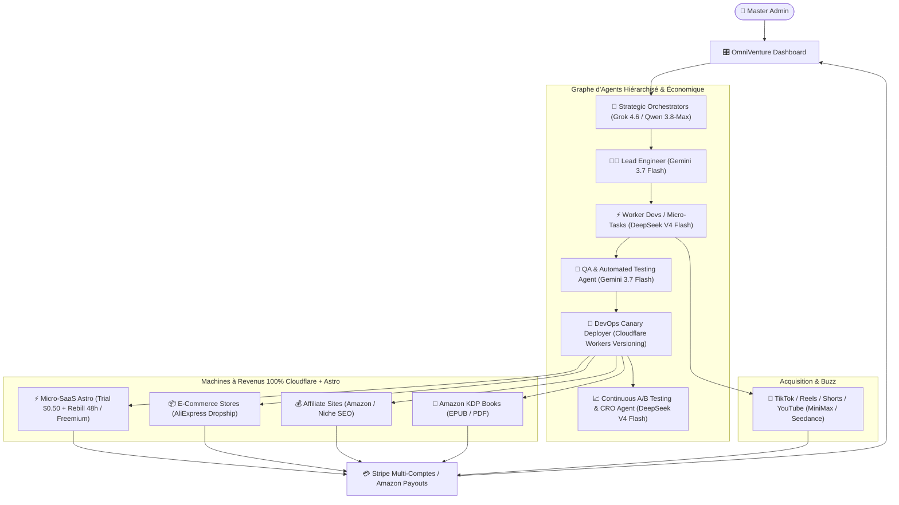

# 🚀 OmniVenture AI — Autonomous Money Factory & Business Engine

> **Plateforme d'Orchestration Multi-Agents pour la Génération, le Déploiement, la Monétisation et la Maintenance Automatique d'Empires Digitaux (Micro-SaaS, Dropshipping, Affiliation, KDP eBooks & Viral Marketing).**

---

## 📑 Sommaire
1. [Vue d'ensemble & Vision](#-vue-densemble--vision)
2. [Modèles Économiques Intégrés (Business Engines)](#-modèles-économiques-intégrés)
3. [Architecture Multi-Agents Hiérarchique (Agent Graph)](#-architecture-multi-agents-hiérarchique)
4. [Matrice d'Optimisation des Coûts LLM & Média](#-matrice-doptimisation-des-coûts-llm--média)
5. [Modules du Dashboard & Fonctionnalités Clés](#-modules-du-dashboard--fonctionnalités-clés)
6. [Pipeline Vidéo Virale & Content Engine](#-pipeline-vidéo-virale--content-engine)
7. [Architecture Technique & Stack Recommandée](#-architecture-technique--stack-recommandée)
8. [Schéma de Données (Database Schema)](#-schéma-de-données)
9. [Roadmap de Développement](#-roadmap-de-développement)

---

## 🎯 Vue d'ensemble & Vision

**OmniVenture AI** est une tour de contrôle unifiée ("Control Tower") permettant de créer, lancer et piloter des dizaines de business en ligne automatisés avec une intervention humaine minimale.

Grâce à un **graphe d'agents distribués** piloté par un Orchestrateur Stratégique (Frontier Reasoning Model) et exécuté par des Worker Agents ultra-rapides et économiques, la plateforme transforme des opportunités de marché en assets monétisés en quelques minutes.



---

## 💰 Matrice d'Optimisation des Coûts LLM & Média

Pour garantir une rentabilité maximale (**ROI > 95%** sur les coûts d'infrastructure IA) grâce au découpage atomique des tâches :

| Rôle & Spécialité | Modèle Sélectionné | Rôle dans le Pipeline | % du Volume | Coût Approximatif |
|---|---|---|---|---|
| **Stratégie & Découpage DAG** | **Grok 4.6** / **Qwen 3.8-Max** | Orchestration globale, validation haut-niveau, prompts maîtres | ~2% | Modéré (~$1.50 - $2.50 / 1M tok) |
| **Lead Engineer & Architecte** | **Gemini 3.7 Flash** | Architecture Astro, intégration Stripe, sécurité, QA de code | ~18% | Faible (~$0.15 - $0.30 / 1M tok) |
| **Micro-Développeur Intensif** | **DeepSeek V4 Flash** | Composants UI Astro, styles, SEO, routes simples, micro-patchs | ~75% | Ultra-Faible (~$0.05 - $0.12 / 1M tok) |
| **Agent QA & Recette** | **Gemini 3.7 Flash** | Test TypeScript, audit Lighthouse, simulation webhook Stripe | ~3% | Faible (~$0.15 / 1M tok) |
| **Agent A/B Testing & CRO** | **DeepSeek V4 Flash** | Variantes d'accroches, optimisation de prix $0.50 vs $1.00 | ~1% | Ultra-Faible |
| **Voix-off (TTS)** | **Edge-TTS / ElevenLabs** | Narration pour vidéos virales TikTok / Shorts | À la demande | 0$ (Local) à $0.01 / min |
| **Génération Vidéo** | **MiniMax Video / Seedance** | Rendu cinématique scènes courtes 9:16 | À la demande | ~$0.05 - $0.15 / clip |

## 💸 Modèles Économiques Intégrés (Business Engines)

### 1. Micro-SaaS Factory (Astro + Workers)
- **Modèle A (Micro-Trial Aggressif)** : Période d'essai à **0.50$** pendant 24h ou 48h $\rightarrow$ passage automatique en abonnement récurrent ($29/mois ou $49/mois). Gestion native des webhooks Stripe, récupération de churn, relance dunning et passerelles anti-fraude.
- **Modèle B (Freemium / Usage-based)** : Inscription gratuite avec quotas d'utilisation $\rightarrow$ blocage de fonctionnalités premium $\rightarrow$ upgrade Stripe Checkout.
- **Génération 100% Cloudflare Native** : Frontend Astro SSR (Cloudflare Pages), Backend Cloudflare Workers (TypeScript/Hono), Base de données Cloudflare D1 (SQL serverless), Cache Cloudflare KV, Stockage Cloudflare R2 et passerelle Stripe préconfigurés.

### 2. Dropshipping & E-Commerce Automatisé
- **Product Hunter** : Scraping de produits tendances sur AliExpress, Alibaba, TikTok Creative Center, Amazon Movers & Shakers.
- **Store Builder** : Génération instantanée de landing pages mono-produit Astro ultra-convertissantes (copywriting persuasif, compteurs d'urgence, avis clients synthétiques, bundles 1 acheté = 1 offert).
- **Fulfillment Pipeline** : Redirection automatique des commandes vers les fournisseurs via API/Webhooks.

### 3. Sites d'Affiliation & Portails de Contenu SEO
- **Programmatic SEO** : Génération de 100 à 1 000 articles comparatifs ciblés sur des requêtes transactionnelles (ex: *"Meilleur outil X 2026"*, *"Avis Y vs Z"*).
- **Intégration d'Affiliation** : Insertion dynamique et masquage (cloaking) des liens affiliés Amazon Associates, ClickBank, ShareASale ou plateformes SaaS d'affiliation.
- **Rich Snippets & Schema.org** : Balisage automatique FAQ, Review, Product pour dominer Google et Google Discover.

### 4. Usine à Ebooks Amazon KDP & Info-produits
- **Génération Structurée** : Plan détaillé, rédaction chapitre par chapitre avec cohérence narrative, relecture stylistique et mise en forme.
- **Export Multi-format** : Compilation automatique en formats `.epub`, `.pdf` (prêt pour KDP Print avec marge et fond perdu) et `.kpf`.
- **Génération de Couvertures** : Prompts d'illustrations haute résolution adaptés aux spécifications de couverture Amazon KDP.

---

## 🎬 Pipeline Vidéo Virale & Content Engine

Pour propulser les SaaS, produits e-commerce et livres, un module vidéo automatisé produit des vidéos courtes et percutantes pour **TikTok, Instagram Reels, YouTube Shorts et YouTube Faceless**.

| Étape | Rôle de l'Agent | Outils / Modèles Utilisés |
|---|---|---|
| **1. Hook & Script** | Analyse des scripts viraux du moment et rédaction de scripts avec rétention élevée | DeepSeek V4 Flash / Gemini 3.7 Flash |
| **2. Voix-Off (TTS)** | Génération de voix ultra-réalistes et expressives | Edge-TTS (gratuit/local) / ElevenLabs |
| **3. Génération Vidéo** | Création de plans cinématiques, avatars ou scènes de démonstration | **MiniMax Video**, **Seedance**, **Hailuo**, **Kling AI** |
| **4. Montage & Sous-titres** | Assemblage FFmpeg, sous-titres animés style Alex Hormozi, musique de fond libre de droits | Moteur FFmpeg automatisé + Whisper pour synchronisation |
| **5. Multi-Diffusion** | Export multi-résolution (9:16 vertical, 16:9 paysage) et programmation | Planificateur / Webhooks API TikTok / YouTube |

---

## 🎛️ Modules du Dashboard & Fonctionnalités Clés

1. **Mission Control (Vue d'ensemble)** :
   - MRR Global & Chiffre d'Affaires cumulé (Stripe multi-comptes, Amazon Associates, KDP).
   - État de santé des sites en direct (Uptime, Conversions, Alertes).
2. **Venture Factory (Générateur en 1-Clic)** :
   - Wizard interactif pour créer : SaaS, E-com Dropship, Site Affilié, Ebook KDP.
   - Sélecteur de Business Model (Freemium vs Trial $0.50 -> Rebill).
3. **Agent Graph & Log Studio** :
   - Visualisation en temps réel de l'activité des agents et des coûts consommés par projet.
4. **Stripe & Cash Vault Manager** :
   - Gestion de comptes Stripe multiples pour éviter la concentration des risques.
   - Configuration des devises, webhooks et dunning automatique.
5. **Media & Viral Studio** :
   - File d'attente de génération vidéo (Scripts $\rightarrow$ Voix $\rightarrow$ Rendu Vidéo $\rightarrow$ Export).
   - Bibliothèque d'assets générés (logos, bannières, mockups 3D, vidéos).
6. **Incident Orchestrator & Self-Healing Sentinel** :
   - Détection d'anomalie Canary (Grok 4.6 / Qwen 3.8-Max) $\rightarrow$ Diagnostic low-cost par DeepSeek V4 Flash.
   - Arbitrage intelligent : Déploiement d'un Hotfix d'urgence (< 60s) si le bug est isolé, ou Rollback instantané (0ms) vers la version $N-1$ si critique.
   - A/B Testing continu (Multi-Armed Bandit) pour maximiser le MRR.
7. **Atelier d'Analyse Concurrentielle** (`/market`) :
   - Lecture réelle du site visé : l'accueil, puis les liens internes vers tarifs, fonctionnalités, clients, intégrations et nouveautés (jusqu'à 7 pages).
   - Relevé factuel extrait du HTML (montants affichés, réassurance, produits tiers cités, langues, technos) présenté séparément de l'interprétation du modèle.
   - Dossier exploitable : paliers de prix, grille de comparaison, preuves sociales sourcées, argumentaire objection → réponse, plan 90 jours, export Markdown.
8. **Panneau de Supervision Flottant** (toutes les pages) :
   - Disponibilité 24 h, erreurs, incidents ouverts et utilisateurs actifs, relevés toutes les 10 s sur `/api/monitoring-summary`.
   - Déplaçable, réductible en pastille, position conservée d'une session à l'autre.
   - Aucune valeur simulée : une métrique non mesurable s'affiche « — » avec sa raison.

---

## 🛠️ Architecture Technique & Stack Cloudflare + Astro

- **Framework Web & Edge SSR** : **Astro** avec l'adaptateur `@astrojs/cloudflare` (mode Hybrid / SSR).
  - *Zéro JavaScript par défaut* : Vitesse extrême, SEO imbattable pour l'Affiliation et les Landing Pages Dropship.
  - *Islands Architecture* : Chargement de composants interactifs (React/Svelte/Vanilla) uniquement dans les zones dynamiques (outils SaaS, modales Stripe).
  - *Content Collections* : Gestion ultra-performante du Programmatic SEO (centaines d'articles d'affiliation).
- **Agent Orchestrator & Durable State** :
  - **Cloudflare Agents SDK** avec **Durable Objects (SQLite intégré par agent)** pour garantir la persistance des sessions et l'exécution sans interruption.
  - **Workers AI & Routing LLM** (OpenRouter / AGY CLI / Anthropic / Gemini Flash) avec équilibrage de charge dynamique.
- **Base de Données Globale** : **Cloudflare D1 (SQL Serverless)** pour les métriques de revenus, la liste des ventures, les logs d'agents et les utilisateurs.
- **Stockage d'Assets (Vidéos, Ebooks, Images)** : **Cloudflare R2** (zéro frais d'egress).
- **Moteur de Tâches en Arrière-Plan** : **Cloudflare Workflows & Queues** pour les rendus vidéo lourds (MiniMax, Seedance) et le scraping AliExpress / Amazon.
- **Intégrations Monétisation & Stripe** :
  - Stripe Webhooks avec signature sécurisée.
  - Tunnels de souscription Trial $0.50 avec SetupIntent & conversion 48h.
- **Déploiement Automatique 100% Autonome** :
  - API Cloudflare pour provisionner instantanément des sous-domaines, règles SSL, Workers et Pages pour chaque nouveau SaaS ou boutique créée.

---

## 📊 Schéma de Données (Database Schema)

```
[Venture / Project]
  ├── id (UUID)
  ├── name (String)
  ├── type (Enum: saas, dropship, affiliate, ebook, viral_campaign)
  ├── business_model (Enum: trial_rebill, freemium, one_time, affiliate_cut)
  ├── status (Enum: draft, building, deployed, paused, error)
  ├── domain (String)
  ├── stripe_account_id (String)
  ├── analytics (MRR, Total Revenue, Visitors, Conversion Rate)
  │
  ├── [Agent_Tasks] (Historique des exécutions, prompts, modèles, tokens, coût $)
  ├── [Media_Assets] (Vidéos, images, ebooks, scripts)
  └── [AB_Tests] (Variantes de prix, CTA, taux de conversion respectifs)
```

---

## 🚀 Prochaines Étapes & Démarrage

Consultez le document de spécifications détaillées [PRD.md](file:///C:/Users/grego/Projets/dotworldAlt/factoryWebsite/PRD.md) pour les spécifications fonctionnelles complètes, le diagramme des flux de paiement Stripe, et le plan d'implémentation.
